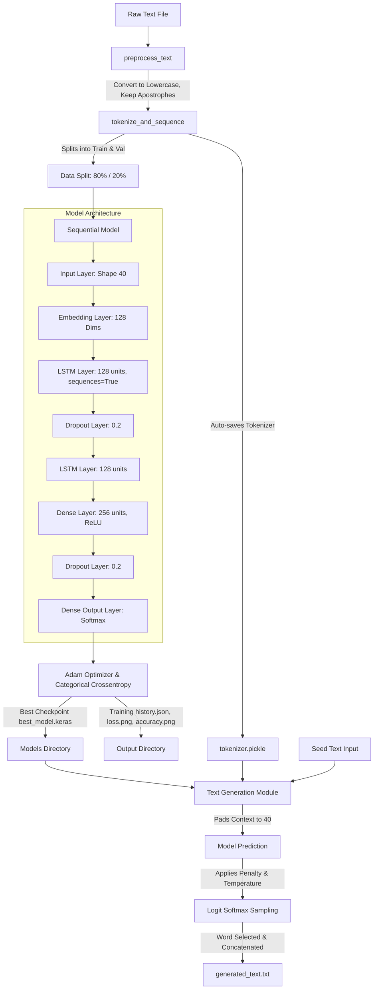

# LSTM Text Generator

A production-quality, modular, and beginner-friendly Python project that uses a deep Long Short-Term Memory (LSTM) Recurrent Neural Network to learn word-level patterns and generate natural Shakespeare-like text. 

---

## Table of Contents
1. [Project Overview](#project-overview)
2. [Features](#features)
3. [Architecture Diagram](#architecture-diagram)
4. [Folder Structure](#folder-structure)
5. [Installation](#installation)
6. [Dataset](#dataset)
7. [Training](#training)
8. [Text Generation](#text-generation)
9. [Sample Output](#sample-output)
10. [Future Improvements](#future-improvements)

---

## Project Overview
Text generation is a foundational natural language processing (NLP) task. This repository implements a robust word-level language model using a Recurrent Neural Network with stacked LSTM cells. The network is trained on scenes from Shakespeare's plays, learning to predict the next word given a context sequence of the preceding **40 words**. 

The implementation features production-level training safety controls (early stopping, validation split, dynamic learning rate reduction, checkpoints) and highly natural text decoding methods (temperature scaling, repetition penalty, padding avoidance, confidence-based early halting).

---

## Features
* **Preservation of Contractions**: Custom preprocessing cleans raw text by stripping layout noise and punctuation while preserving apostrophes (e.g., contractions like `ta'en`, `we'll`, `don't`), leading to a more coherent vocabulary.
* **Deep LSTM Architecture**: Upgraded to a stacked LSTM model (256 dense units, 128 embedding units, two LSTM layers, dropout regularization) for learning complex contextual relationships.
* **Temperature-Based Sampling**: Supports custom sampling temperatures (default: `0.8`) to tune text creativity versus consistency, replacing weak greedy argmax search.
* **Smart Generation Safeguards**: 
  * Automatically ignores index-0 padding tokens during generation.
  * Implements logit-level repetition penalties to prevent repetitive loop bugs (e.g., "the the the...").
  * Halts generation early if prediction confidence drops below a threshold (default: `0.01`).
* **Modular CLI**: Features an interactive shell menu with options to train the model, generate text, view detailed neural network specifications, and exit.
* **Automated Asset Management**: Automatically compiles loss/accuracy plots, history data files, and serialized tokenizer mappings, saving them to dedicated subfolders.

---

## Architecture Diagram



---

## Folder Structure
```text
LSTM_TEXT_GENERATOR/
│
├── dataset/                  # Folder containing raw training text corpora
│   └── shakespeare.txt       # Shakespeare text source
│
├── models/                   # Folder storing serialized weights and mappings
│   ├── best_model.keras      # Saved best Keras sequential model
│   └── tokenizer.pickle      # Serialized vocabulary index map
│
├── output/                   # Folder storing generated plots, logs, and text
│   ├── accuracy.png          # Plot of training and validation accuracy trends
│   ├── loss.png              # Plot of training and validation loss trends
│   ├── history.json          # Dictionary of training history log
│   └── generated_text.txt    # Text file containing the latest generated run
│
├── preprocess.py             # Reusable preprocessing, tokenizing, and sequencing functions
├── model.py                  # Keras deep sequential neural network config
├── train.py                  # Split manager, training scheduler, and visualizer
├── generate.py               # Serial loader and temperature-controlled sampler
├── main.py                   # Master CLI menu wrapper and info panel
│
├── requirements.txt          # Third-party dependency definitions
└── README.md                 # Project documentation (this file)
```

---

## Installation

### 1. Prerequisites
Ensure you have **Python 3.8 or higher** installed on your system.

### 2. Configure Virtual Environment
We recommend running in a clean virtual environment:
```bash
# Create the environment
python -m venv venv

# Activate the environment
# On Linux/macOS:
source venv/bin/activate
# On Windows (Command Prompt):
venv\Scripts\activate
# On Windows (PowerShell):
.\venv\Scripts\Activate.ps1
```

### 3. Install Dependencies
Install all required packages listed in the requirements file:
```bash
pip install -r requirements.txt
```

---

## Dataset
* **Dataset used**: Shakespeare Complete Works
* **Download**: https://www.gutenberg.org/files/100/100-0.txt
* **Save as**: `dataset/shakespeare.txt`

The dataset file is located at `dataset/shakespeare.txt`. It contains dramatic scenes from Shakespeare's classic plays (e.g., *The Taming of the Shrew*, *The Tempest*). The preprocessor cleans the text by stripping out punctuation (except apostrophes), lowercase normalizing all tokens, standardizing unicode quotes, and fitting the tokenizer.

this is my dataset download link https://www.kaggle.com/datasets/thedevastator/the-bards-best-a-character-modeling-dataset?resource=download

---


## Training
To train the model:
1. Run `python main.py` and select Option 1.
2. Alternatively, run the training pipeline directly:
```bash
python train.py
```

### Training Specifications
* **Sequence Length**: 40 words.
* **Validation Split**: 20% validation split, 80% training split.
* **Epochs**: Up to 30 epochs.
* **Callbacks**:
  * `EarlyStopping`: Halts training if validation loss does not improve for 5 epochs. Restores the best weights.
  * `ModelCheckpoint`: Dynamically saves the best model (`best_model.keras`) based on lowest validation loss.
  * `ReduceLROnPlateau`: Scales down learning rate by factor of 0.2 if validation loss plateaus for 3 epochs.
* **Metrics**: Training results (history, loss curve, accuracy curve) are automatically saved to `output/`.

---

## Text Generation
To generate text:
1. Run `python main.py` and select Option 2.
2. Or invoke the generation script directly:
```bash
python generate.py
```

### Generation Strategy
* **Temperature Sampling**: Scales logit distributions before taking a random sample. Configurable range; defaults to `0.8`.
* **Repetition Penalty**: Logit reduction is applied to the last 5 generated words to prevent repetitive output sequences.
* **Confidence Cutoff**: Stop predicting if the chosen word probability falls below `0.01` (avoids gibberish output).
* **Target File**: Results are automatically written to `output/generated_text.txt`.

---

## Sample Output

### CLI Model Information (Option 3)
```text
===================================
MODEL STATUS & METADATA
===================================
Model File:         models/best_model.keras
Tokenizer File:     models/tokenizer.pickle
Vocabulary Size:    2211 words
Input Sequence Len: 40 words
Model File Size:    13.17 MB
Tokenizer File Size: 81.62 KB
-----------------------------------
Model Architecture Summary:
Model: "sequential"
_________________________________________________________________
 Layer (type)                Output Shape              Param #   
=================================================================
 embedding (Embedding)       (None, 40, 128)           282880    
 lstm (LSTM)                 (None, 40, 128)           131584    
 dropout (Dropout)           (None, 40, 128)           0         
 lstm_1 (LSTM)               (None, 128)               131584    
 dense (Dense)               (None, 256)               33024     
 dropout_1 (Dropout)         (None, 256)               0         
 dense_1 (Dense)             (None, 2210)              567970    
=================================================================
Total params: 1,147,042 (4.38 MB)
Trainable params: 1,147,042 (4.38 MB)
Non-trainable params: 0 (0.00 B)
===================================
```

### Option 2: Text Generation
```text
Enter the starting seed phrase: shall i compare thee to a summers day
Enter number of words to generate: 20
Enter temperature (default 0.8, range 0.1-2.0): 0.85

Predicting and generating text...
Generating 20 words with temperature=0.85...

--- Generated Text ---
shall i compare thee to a summers day i love thy beauty's grace and shall not let thee fade
----------------------
```

---

## Future Improvements
* **Advanced Decoders**: Add Beam Search, Top-K, or Nucleus (Top-P) sampling to balance creativity and vocabulary coherence.
* **Recurrent Enhancements**: Experiment with bidirectional LSTMs or GRUs (Gated Recurrent Units) to speed up training.
* **Transformer Architectures**: Upgrade the token prediction layers to a self-attention Transformer model (e.g., custom decoder GPT-style block) to capture much longer context dependencies.
* **Corpus Scaling**: Fine-tune on the complete works of William Shakespeare or larger classic literature text files.
